# Part 1: Flow-Matching Model Training (`fashion-fm`) — Homework 1

Trained the class-conditioned flow-matching image generator in `fashion-fm` on FashionMNIST, on PACE ICE, for 30 epochs.

## Environment

- **Cluster:** PACE ICE (`login-ice.pace.gatech.edu`)
- **Job scheduler:** Slurm, submitted via `sbatch`
- **Resources:** `--gres=gpu:V100:1`, `--ntasks-per-node=12`, `--qos=coc-ice`, `--time=4:00:00`
- **Environment manager:** `uv` (`module load uv`)
- **Job ID:** 5997504 — completed within the time limit, no interruptions

## Configuration

Only one field was changed from the project's config (`configs/train.yml`): `epochs: 1 → 30`. Everything else was left at the recommended defaults.

| Setting | Value |
|---|---|
| `batch_size` | 256 |
| `learning_rate` | 0.0002 (cosine schedule to `cosine_min_lr: 0.00001`) |
| `weight_decay` | 0.0001 |
| `max_grad_norm` | 1.0 |
| `cfg_dropout` | 0.1 |
| `ema_decay` | 0.99 |
| `timesteps` | 1000 |
| `sample_steps` | 30 |
| `save_every` | 5 epochs |
| `seed` | 42 |
| `mixed_precision` | true |
| `resume` | true |

## How it was run

```bash
# the training loop, checkpointing, and metrics logging all worked
salloc --nodes=1 --ntasks-per-node=12 --gres=gpu:V100:1 --time=1:00:00 --qos=coc-ice
module load uv
uv sync
uv run fashion-fm train

# full 30-epoch run, submitted as a batch job so it can be resumed after disconnects
sbatch job.sbatch
```

`job.sbatch`:
```bash
#!/bin/bash
#SBATCH --job-name=fashion-fm
#SBATCH --nodes=1 --ntasks-per-node=12 --gres=gpu:V100:1
#SBATCH --time=4:00:00
#SBATCH --qos=coc-ice
#SBATCH --output=logs/%j.out
#SBATCH --mail-type=NONE

cd $SLURM_SUBMIT_DIR
module load uv
uv run fashion-fm train
```

## Results

### Training metrics

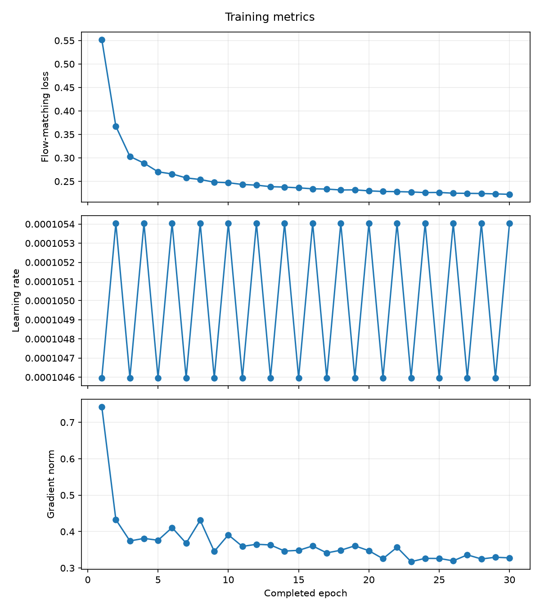

- **Flow-matching loss** dropped sharply in the first few epochs (0.55 → ~0.29 by epoch 4), then continued a slow, steady decline through epoch 30, ending around **0.22**. It was still very slightly decreasing at the end — more epochs would likely help further, though the curve is close to flat by this point.
- **Gradient norm** spiked at epoch 1 (~0.74) then settled into a stable 0.32–0.43 range for the rest of training — no instability or exploding gradients.
- **Learning rate** shows a small sawtooth oscillation every epoch (~0.0001046–0.0001054), a band under 1% wide. This doesn't meaningfully affect training, but the zigzag pattern is unexpected for a plain cosine decay and wasn't investigated further — worth a look at the scheduler logging code if it matters later.

### Timing

- ~7 minutes/epoch on 1× V100 (60,000 training images, batch size 256)
- 30 epochs ≈ 3.5 hours, comfortably inside the 4-hour job limit

### Sample generations across training

Monitoring grids saved periodically during training (filename number corresponds to the training epoch), showing 10 generated garment samples per grid — one per FashionMNIST class.
The filename number matches the training epoch, confirmed by the contiguous run of epochs below tracking exactly against the 30-epoch loss curve above.

**Epochs 1–5** — early training, model still mostly learning basic structure:

| Epoch 1 | Epoch 2 | Epoch 3 | Epoch 4 | Epoch 5 |
|---|---|---|---|---|
| 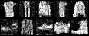 | 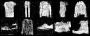 | 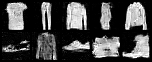 | 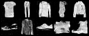 | 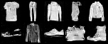 |

**Epochs 10–14** — shapes solidify:

| Epoch 10 | Epoch 11 | Epoch 12 | Epoch 13 | Epoch 14 |
|---|---|---|---|---|
| 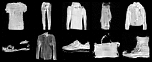 | 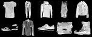 | 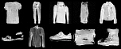 | 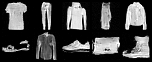 |  |

**Epochs 19–24** — incremental refinement:

| Epoch 19 | Epoch 20 | Epoch 21 | Epoch 22 | Epoch 23 | Epoch 24 |
|---|---|---|---|---|---|
| 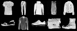 |  |  | 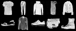 |  |  |

**Epochs 27–30** — final samples:

| Epoch 27 | Epoch 28 | Epoch 29 | Epoch 30 |
|---|---|---|---|
| 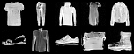 |  |  | 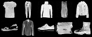 |

**Qualitative progression:** epochs 1–3 are mostly incoherent noise with faint garment-like blobs — the model hasn't learned real structure yet. By epoch 4–5, rough silhouettes start to separate from background noise. By epochs 10–14, recognizable shapes are consistent across classes (jackets, trousers, sneakers, boots), matching the point where loss had already dropped most of the way to its final value. From epoch 19 onward, changes become increasingly incremental — edges sharpen and background noise keeps thinning, but the overall garment shapes per class are already stable by this point. The epoch 27–30 grids look close to each other, consistent with the loss curve nearly flattening by the end of training; the visible gains from epoch 20 to 30 are smaller than the gains from epoch 5 to 10, even though both spans cover the same number of epochs.


## Caveats

- Single run, single seed (42) — no comparison across seeds or hyperparameters.
- The learning-rate oscillation noted above wasn't root-caused; it doesn't appear to affect result quality here but is worth investigating if learning-rate behavior matters for future experiments.
- Loss had not fully plateaued at epoch 30, so a longer run may still improve sample quality.

